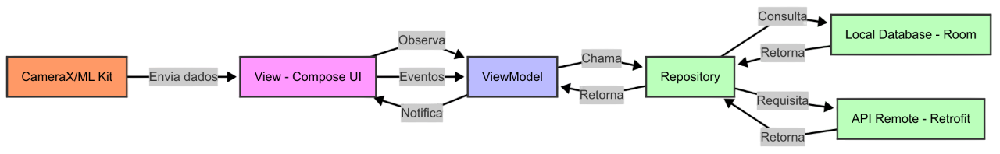
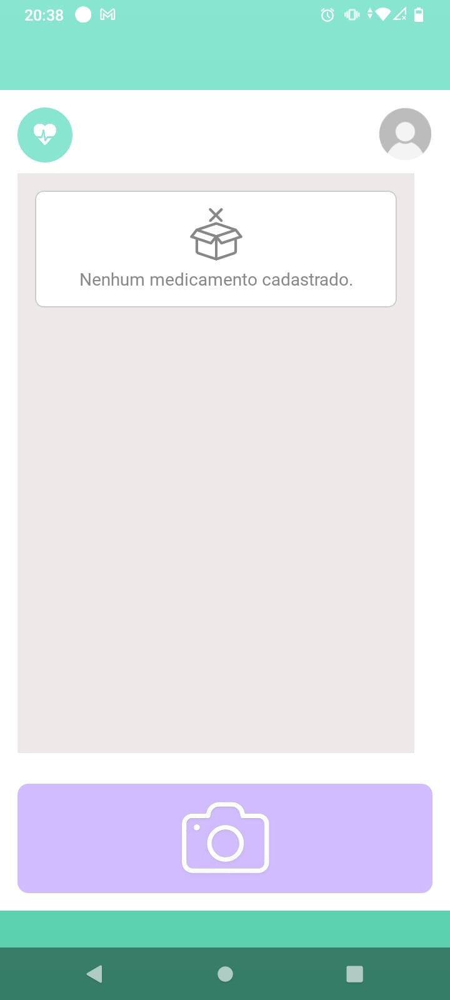
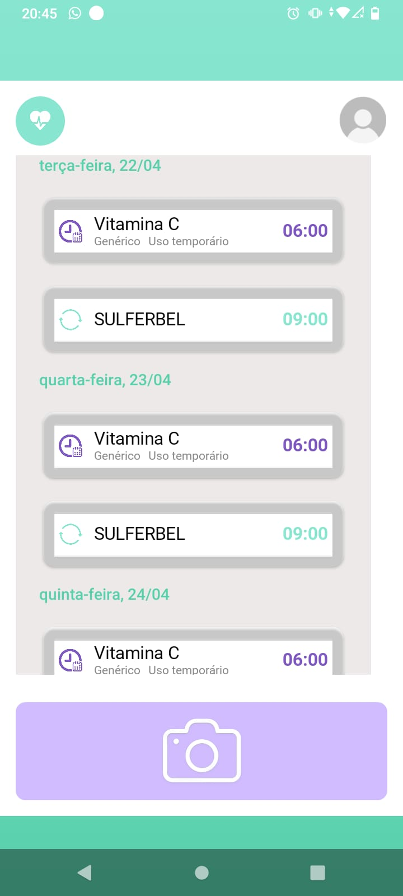
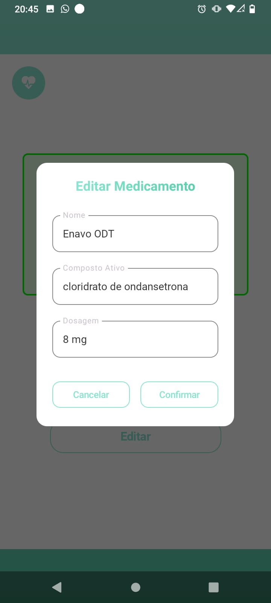
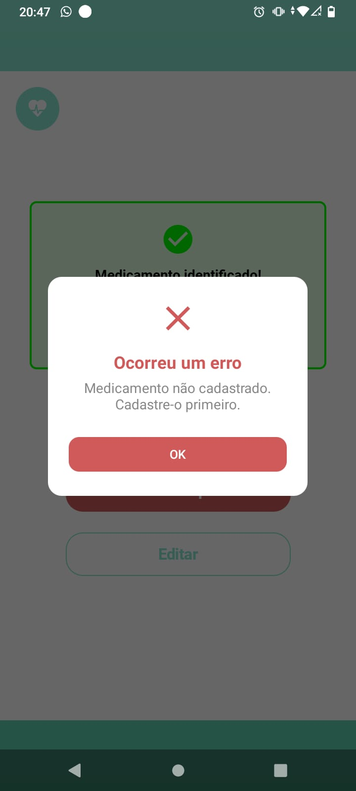
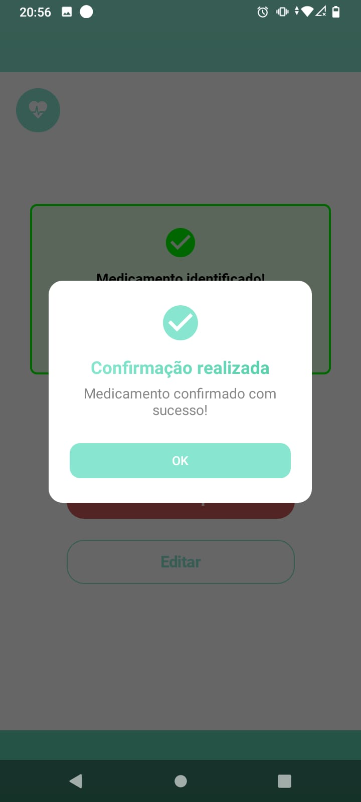
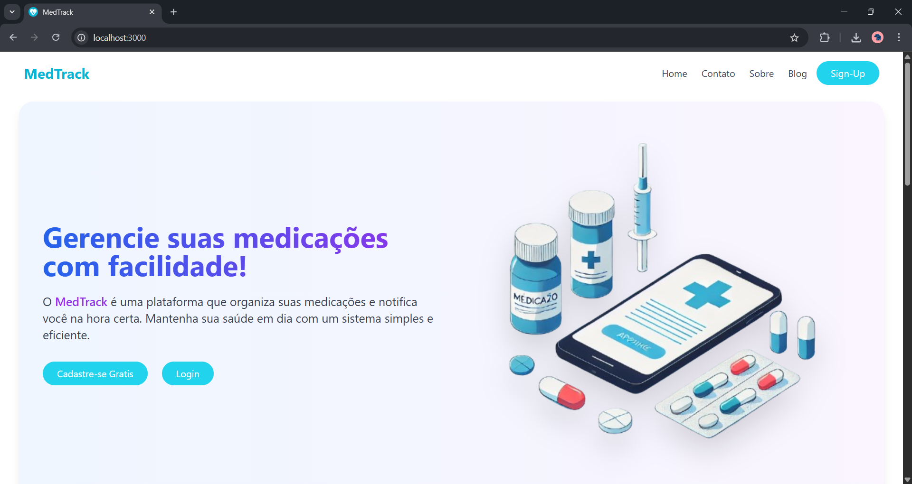

# MedTrack Mobile: Mobile 📱

<div align="center">
    
</div>


> Aplicativo Android para controle inteligente de medicação via OCR e notificações

---

## Visão Geral

<div align="center">
  
</div>

O **MedTrack Mobile** é um app Android desenvolvido para auxiliar no acompanhamento correto de medicamentos, unindo **OCR, notificações e acessibilidade** em um só lugar.

- 🔔 **Notificações inteligentes**
- 📸 **Validação por foto** usando tecnologia OCR
- ♿ **Acessibilidade** como prioridade

**Público-alvo:**
- 👴 Idosos e pacientes com muitos rémedios que dificulte a organização
- 🧑‍⚕️ Cuidadores e familiares para monitoramento
---

## ✨ Destaques Técnicos

### 🏗️ Arquitetura do Projeto
O MedTrack foi desenvolvido seguindo os princípios do **MVVM (Model-View-ViewModel)** para garantir uma separação clara de responsabilidades e facilitar a manutenção do código. Utilizamos componentes modernos do Android Jetpack como:
- ViewModel para gerenciamento de dados da UI
- LiveData para atualizações reativas
- Coroutines para operações assíncronas

<div align="center">
  
</div>

### 🎨 Interface Gráfica
Desenvolvida inteiramente com **Jetpack Compose**, a interface prioriza:
- Design moderno e intuitivo
- Acessibilidade

> Lista com os horários dos remédios, diferenciando de remédio com uso Contínuo e Temporário
<div align="center">
  
  
</div>

> Pop-ups informativos
<div align="center">
  
  
  
</div>

### 📸 Captura e Reconhecimento (OCR)
Integramos as poderosas ferramentas do **Google ML Kit (*Text recognition* e *Object detection*)** para:
- **OCR (Reconhecimento Óptico de Caracteres)** para extrair dados de bulas e caixas de remédio
- **Detecção de objetos** para identificar medicamentos na câmera
- Processamento offline para garantir privacidade e disponibilidade

> 🎥 Demonstração do OCR identificando: nome do medicamento, dosagem e horários

<div align="center">
  
</div>

### 💾 Armazenamento Local
Para persistência de dados, utilizamos:
- **Room Database** como camada de abstração sobre SQLite
- Armazenamento seguro de informações sensíveis
- Sincronização eficiente com o backend

```kotlin
@Database(
    entities = [Usuario::class, Medicamento::class, Notificacao::class, Confirmacao::class],
    version = 4
)
    abstract class AppDatabase : RoomDatabase() {
    abstract fun medicineDao(): MedicineDao
}
````

### 🌐 Comunicação com API
Integração com o backend através de:

- Retrofit para requisições HTTP

- Moshi para serialização/desserialização JSON

Tratamento robusto de erros e estados de carregamento:

````kotlin
interface ApiService {

    @POST("auth/mobile/login")
    suspend fun login(@Body loginRequest: LoginRequest): Response<LoginResponse>

    @GET("usuario/mobile")
    suspend fun getUsuario(@Header("Authorization") token: String): Response<Usuario>

    @GET("medicamento/mobile/lista")
    suspend fun getMedicamentos(@Header("Authorization") token: String): Response<List<Medicamento>>

    @POST("/api/confirmacao")
    suspend fun confirmarMedicamento(
        @Header("Authorization") token: String,
        @Body request: DadosConfirmacaoRequest
    )

}
````

### 🔧 Outras Bibliotecas

- AlarmManager para agendamento de notificações
- Material3 para componentes UI modernos

---

## 🚀 Como Executar

1. **Pré-requisitos**:
    - Android Studio Giraffe+
    - Dispositivo/emulador com Android 9+

2. **Configuração**:
    - Clonar repositório
```bash
git clone https://github.com/seu-usuario/medtrack-mobile.git
````
> Configurar variáveis no ApiClient.kt para o endpoint do Backend:

```kotlin
  class ApiClient {
    private val BASE_URL = "http://seu-endpoint:8081"
  }
````
---

## 🌐 MedTrack: Versão Web

<div align="center">
  <a href="https://github.com/EllenRocha1/MedTrack" target="_blank">
    
  </a>
</div>

### Plataforma Complementar
O **MedTrack Web** é a interface administrativa do sistema, desenvolvida para:

- 👩‍⚕️ **Profissionais de saúde** gerenciarem pacientes
- 👨‍👩‍👧 **Familiares** acompanharem a medicação remota
- 📊 Visualização de relatórios e histórico completo

<div align="center">
  
</div>

### Integração Mobile-Web
- 🔄 Sincronização em tempo real dos dados de medicação
- 🔐 Autenticação unificada JWT
- 📩 Notificações complementares via email

---

## 🌟 Time de Contribuidores

<div align="center" style="margin: 40px 0;">

<div style="display: flex; justify-content: center; flex-wrap: wrap; gap: 30px;">

<!-- Yann Leão -->
<div style="text-align: center; width: 150px;">
  <a href="https://github.com/YannLeao" target="_blank">
    
  </a>
  <h3 style="margin: 10px 0 5px;">Yann Leão</h3>
  <div style="display: flex; justify-content: center; gap: 10px;">
    <a href="https://github.com/YannLeao" target="_blank">
      
    </a>
    <a href="https://www.linkedin.com/in/yannleao-dev" target="_blank">
      
    </a>
  </div>
  <p style="font-size: 14px; color: #666;">Backend & Mobile</p>
</div>

<!-- Ellen Rocha -->
<div style="text-align: center; width: 150px;">
  <a href="https://github.com/EllenRocha1" target="_blank">
    
  </a>
  <h3 style="margin: 10px 0 5px;">Ellen Rocha</h3>
  <div style="display: flex; justify-content: center; gap: 10px;">
    <a href="https://github.com/EllenRocha1" target="_blank">
      
    </a>
    <a href="https://www.linkedin.com/in/ellen-rocha-dev/" target="_blank">
      
    </a>
  </div>
  <p style="font-size: 14px; color: #666;">Backend & Frontend</p>
</div>

<!-- Maria Clara -->
<div style="text-align: center; width: 150px;">
  <a href="https://github.com/MClaraFerreira5" target="_blank">
    
  </a>
  <h3 style="margin: 10px 0 5px;">Maria Clara</h3>
  <div style="display: flex; justify-content: center; gap: 10px;">
    <a href="https://github.com/MClaraFerreira5" target="_blank">
      
    </a>
    <a href="https://www.linkedin.com/in/clara-ferreira-dev/" target="_blank">
      
    </a>
  </div>
  <p style="font-size: 14px; color: #666;">Frontend & Mobile</p>
</div>

</div>
</div>

---

## 📄 Licença

Projeto acadêmico desenvolvido para a disciplina de **Projeto Interdisciplinar de Engenharia da Computação 1 (PIEC1)**  
Universidade Federal Rural de Pernambuco — Unidade Acadêmica de Belo Jardim (UFRPE/UABJ)


